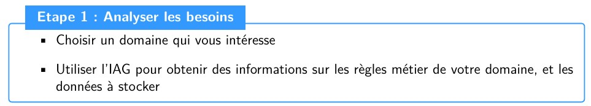

# Prompt_Conception_Base

## [📌 Introduction du projet](./docs/rapport_complet.pdf)
Ce mini-projet a pour objectif de mettre en pratique, de manière concrète et progressive, l’ensemble des étapes de la méthode MERISE, telle qu’elle est enseignée dans ce module et largement utilisée dans l’industrie pour la conception et le développement de bases de données.  
MERISE est une méthode structurée qui permet de passer des besoins métiers exprimés en langage naturel, vers un modèle logique puis un schéma technique exploitable dans un système d’information réel. Elle offre une démarche rigoureuse, claire et communicable entre les différents acteurs d’un projet (métiers, analystes, développeurs, administrateurs de bases de données).  

Le travail consiste à analyser le fonctionnement d’une entreprise du domaine du transport aérien (ici, une compagnie similaire à EasyJet) afin d’identifier ses règles de gestion, des flux d’information, ses contraintes réglementaires et ses besoins opérationnels. L’accent est mis sur la modélisation de la base de données qui doit soutenir les activités essentielles de l’entreprise : planification et suivi des vols, gestion de la flotte et des équipages, réservation et paiement, services additionnels, gestion des passagers, conformité réglementaire et communication avec les clients.  

Le choix de ce sujet ne relève pas du hasard. En effet, nous avons tous été un jour confrontés à des retards de vols, à des problèmes de réservation ou encore à des surcoûts inattendus liés aux bagages ou aux sièges. Ces situations, bien que fréquentes, soulèvent une question essentielle : comment fonctionnent réellement les systèmes internes des compagnies aériennes et quels sont les éléments qui justifient ces contraintes vécues par les passagers ?  

Notre objectif est donc double :  
- d’une part, modéliser et analyser les processus de gestion d’une compagnie aérienne low-cost, depuis la réservation en ligne jusqu’à l’embarquement, en passant par la gestion des vols et des options payantes ;  
- d’autre part, envisager des pistes d’optimisation en comprenant mieux l’organisation des données et les flux d’information.  

Ainsi, ce projet ne se limite pas à une simple construction de base de données : il constitue également un exercice de compréhension des enjeux réels du transport aérien, et une première étape vers une réflexion sur l’amélioration de l’expérience client.  

---

### Nos choix
Dans la rédaction de ce prompt, nous avons choisi de suivre une structure progressive et logique. Nous avons commencé par poser le contexte avec l’exemple d’EasyJet, afin de montrer clairement le modèle économique et le fonctionnement de l’entreprise. Nous avons ensuite précisé que l’objectif était d’appliquer la méthode MERISE en nous concentrant uniquement sur la phase d’analyse. Le prompt est construit autour de deux parties principales : les règles de gestion rédigées simplement et le dictionnaire de données brutes détaillé, avec des consignes de présentation pour que le résultat soit clair et exploitable. Dans la partie conception, nous avons poursuivi en traduisant ces règles de gestion en un modèle conceptuel des données, ce qui permet de représenter les entités, leurs attributs et leurs relations. Nous avons ensuite affiné ce modèle pour obtenir une organisation cohérente et normalisée, en supprimant les redondances et en respectant la troisième forme normale. Ce choix nous permet d’aboutir à une base de données fiable, claire et adaptée aux besoins de l’entreprise, tout en facilitant les étapes de mise en œuvre.

## [📄 Notre Prompt](./docs/prompt.pdf)

Tu travailles dans le domaine du transport aérien. Ton entreprise exerce une activité de transport aérien comparable à celle d’EasyJet. EasyJet est une compagnie aérienne britannique fondée en 1995, spécialisée dans le transport aérien à bas coût. Basée principalement à l’aéroport de Londres-Luton, elle dessert aujourd’hui plus de 150 destinations. Son modèle économique repose sur la simplification des services afin de proposer des tarifs attractifs, avec des billets vendus exclusivement en ligne,
l’absence de services superflus inclus, et la possibilité pour le client de choisir des options payantes comme les bagages ou la sélection de sièges. EasyJet s’adresse principalement aux voyageurs recherchant des déplacements rapides et économiques, que ce soit pour le tourisme ou les voyages d’affaires.

Ton entreprise souhaite appliquer la méthode MERISE pour concevoir un système d’information. Dans ce cadre, tu es chargé de la partie analyse, qui consiste à collecter et formaliser les besoins métiers de l’entreprise. Le travail de conception et de développement de la base de données sera ensuite confié à un étudiant en ingénierie informatique. Pour accomplir cette mission, tu dois d’abord établir les règles de gestion des données de l’entreprise et les présenter sous la forme d’un texte clair et compréhensible. 
Ces règles doivent être rédigées comme si elles étaient expliquées à une personne connaissant bien le fonctionnement de l’entreprise mais ne maîtrisant pas la méthode MERISE. Elles doivent couvrir l’ensemble des aspects liés à l’activité, à savoir la gestion des vols, des avions et des aéroports, les réservations et leurs modalités, les options payantes qui reflètent le modèle économique low-cost, ainsi que les informations relatives aux passagers et aux paiements. Chaque règle doit être rédigée de manière précise, factuelle et sans ambiguïté afin de refléter fidèlement le fonctionnement de l’entreprise.

À partir de ces règles de gestion, tu dois ensuite construire un dictionnaire de données brutes qui prendra la forme d’un tableau clair et lisible. Ce dictionnaire doit contenir entre 25 et 35 données distinctes et pour chacune d’elles, tu devras indiquer la signification en langage simple, le type de donnée (texte, numérique, date, heure, booléen, décimal, etc.) ainsi que la taille maximale en nombre de caractères ou de chiffres. Les données doivent être cohérentes avec la réalité métier, par exemple un code IATA limité à trois caractères, un numéro de vol sur six caractères, une adresse email pouvant contenir jusqu’à cinquante caractères, ou encore un montant payé exprimé en numérique avec deux décimales. Il est important d’intégrer également les données relatives aux options additionnelles comme les bagages en soute ou la sélection de sièges, 
afin de bien représenter le modèle économique low-cost adopté par l’entreprise.

Enfin, la présentation du travail doit être soignée et professionnelle. Le texte des règles de gestion doit être rédigé de manière structurée et numérotée afin de pouvoir être facilement réutilisé par la suite. Le dictionnaire de données, quant à lui, doit être présenté sous forme de tableau aligné et lisible, sans redondance, de façon à ce qu’il constitue un support de travail directement exploitable pour la phase suivante de conception. Chaque donnée décrite dans le dictionnaire doit pouvoir être reliée
à au moins une règle de gestion.

## [🤖 Résultat IAG](./docs/resultat.pdf)

## 📑 Règles de gestion des données

### ✈️ Gestion des vols
Chaque vol est identifié par un **numéro de vol unique** composé de 6 caractères alphanumériques.  
Un vol correspond à une liaison entre un aéroport de départ et un aéroport d’arrivée, définis par leurs **codes IATA**.  
Il possède une **date et une heure de départ planifiées** ainsi qu’une **heure d’arrivée estimée** (le jour même pour les trajets court-courrier).  
Chaque vol est opéré par un **avion de la flotte** ; le nombre de sièges disponibles correspond à la capacité de cet avion.

---

### 🛫 Gestion des aéroports
Chaque aéroport desservi est identifié par un **code IATA unique à 3 lettres**.  
Pour chaque aéroport, le système stocke également :  
- le **nom** de l’aéroport  
- la **ville** et le **pays** où il se situe  

Ces informations permettent d’indiquer les origines et destinations des vols dans le système de réservation.

---

### 🛩️ Gestion des avions
La compagnie gère une flotte d’avions.  
Chaque avion est enregistré avec une **immatriculation unique** (ex : F-XXXX).  
Pour chaque avion, on conserve :  
- le **modèle** (ex : Airbus A320-200)  
- le **nombre de sièges disponibles**  

Un avion peut effectuer plusieurs vols au cours du temps, mais un vol donné n’utilise qu’un seul avion.

---

### 🎫 Gestion des réservations
Les vols sont réservés par les clients via la billetterie en ligne.  
Chaque réservation est identifiée par un **code de réservation unique** (référence dossier).  
Une réservation porte sur **un vol spécifique** et peut concerner **un ou plusieurs passagers**.  

Le système enregistre :  
- la **date et l’heure de la réservation**  
- les **coordonnées du client** (email, téléphone)  

---

### 👥 Gestion des passagers
Pour chaque réservation, on enregistre les informations de chaque passager :  
- **prénom et nom** (obligatoires)  
- éventuellement la **date de naissance** (tarifs/identité)  

Tous les passagers d’une même réservation voyagent sur le même vol.  
Chaque passager occupe un siège.

---

### 🧳 Options de services supplémentaires (modèle low-cost)
Certains services ne sont pas inclus d’office dans le billet de base et sont proposés en **options payantes** :  
- **Bagages en soute** (nombre, coût supplémentaire par bagage)  
- **Sélection de siège** (choix d’un numéro précis, supplément)  
- **Embarquement prioritaire** (embarquer avant les autres passagers)  

Chaque option choisie par un client est enregistrée afin de prévoir les services et de calculer le tarif total.

---

### 💳 Gestion des paiements
Toute réservation doit être **payée en totalité** au moment de la réservation.  
Le paiement s’effectue en ligne (ex : carte bancaire).  

Le système enregistre :  
- le **montant total payé** (billets + options), en euros, avec 2 décimales  
- la **date du paiement** (souvent identique à la réservation)  
- le **mode de paiement** utilisé  

Une fois le paiement validé, la réservation est confirmée et les billets électroniques sont émis.

---

## 📊 Dictionnaire de données

| **Nom de la donnée**           | **Signification (en langage simple)**             | **Type**           | **Taille max** |
|--------------------------------|--------------------------------------------------|--------------------|----------------|
| Numéro de vol                  | Identifiant unique d’un vol (code alphanumérique) | Texte              | 6              |
| Date de départ du vol          | Jour de départ prévu du vol                       | Date               | –              |
| Heure de départ du vol         | Heure de départ prévue (locale)                   | Heure              | –              |
| Heure d’arrivée du vol         | Heure d’arrivée prévue (locale)                   | Heure              | –              |
| Immatriculation de l’avion     | Code unique identifiant un avion (ex: F-XXXX)     | Texte              | 6              |
| Modèle d’avion                 | Modèle/type de l’appareil (ex: Airbus A320)       | Texte              | 30             |
| Capacité de l’avion            | Nombre total de sièges dans l’avion               | Nombre entier      | 3              |
| Code IATA de l’aéroport        | Identifiant unique (3 lettres)                    | Texte              | 3              |
| Nom de l’aéroport              | Nom complet de l’aéroport                         | Texte              | 50             |
| Ville de l’aéroport            | Ville où se situe l’aéroport                      | Texte              | 50             |
| Pays de l’aéroport             | Pays où se situe l’aéroport                       | Texte              | 50             |
| Code de réservation            | Référence unique de la réservation                | Texte              | 6              |
| Date de réservation            | Date de création de la réservation                | Date               | –              |
| Heure de réservation           | Heure de création de la réservation               | Heure              | –              |
| Email de contact               | Adresse e-mail du client                          | Texte              | 50             |
| Numéro de téléphone            | Numéro de téléphone du client (format int.)       | Texte              | 15             |
| Prénom du passager             | Prénom tel qu’indiqué                             | Texte              | 30             |
| Nom du passager                | Nom de famille du passager                        | Texte              | 30             |
| Date de naissance du passager  | Date de naissance du passager                     | Date               | –              |
| Nombre de bagages en soute     | Quantité de bagages achetés (0 si aucun)          | Nombre entier      | 1              |
| Siège sélectionné              | Numéro de siège attribué (si réservé)             | Texte              | 3              |
| Option sélection de siège      | Si un siège spécifique a été réservé (oui/non)    | Booléen            | –              |
| Option embarquement prioritaire| Si l’option a été souscrite (oui/non)             | Booléen            | –              |
| Montant total payé             | Total réglé pour la réservation (avec options)    | Nombre décimal     | 7 (2 décimales)|
| Date de paiement               | Date du paiement                                  | Date               | –              |
| Mode de paiement               | Moyen de paiement (ex: carte bancaire)            | Texte              | 20             |

---

